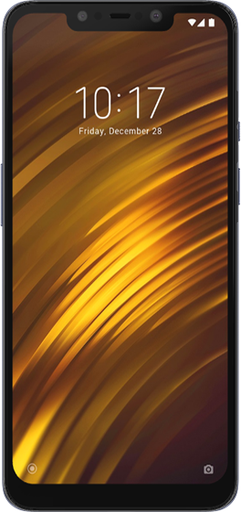
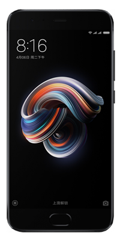

<kbd><b>Connect with us:</b></kbd> 
[</a>](https://t.me/XtendedOfficial "Connect to us on Telegram") [</a>](https://github.com/orgs/Project-Xtended/repositories "Our ROM sources") [</a>](https://twitter.com/projectxtended "Let's talk something")
#

 

 

<b> Official Lenovo Devices</b>

### Lenovo Z6 Pro / Zippo

 | Current Status            | Xtended-XT-v7.0                                                           
 | :---------------          | :------------------------------------------------------------------
 | Maintainer                | [kanstmablason](https://telegram.me/kanstmablason)                     
 | Device Support Group      | [Device Telegram group](https://t.me/LenovoZ6ProChat)                           
 | Download Link             | [Official Download Link for your device](https://downloads.project-xtended.org/?dir=zippo/XT)

#
### Lenovo Zuk Z2 Plus / z2_plus

 | Current Status            | Xtended-XT-v7.0                                                          
 | :---------------          | :------------------------------------------------------------------
 | Maintainer                | [Pranav Temkar](https://telegram.me/PptOo7)                     
 | Device Support Group      | [Device Telegram group](https://t.me/LenovoZukZ2)                           
 | Download Link             | [Official Download Link for your device](https://downloads.project-xtended.org/?dir=z2_plus/XT)

#
 

 

 

<b> Official Xiaomi/Redmi Devices</b>

### Mi A2 Lite / Daisy

  
 | Current Status            | Active                                                            
 | :-------------------------| :----------------------------------------------------------------------
 | Maintainer                | [TogoFire](https://telegram.me/TogoFire)                     
 | Device Support Group      | [Device Telegram group](https://t.me/TogoFireWork)                           
 | Download Link             | [Official Download Link for your device](https://downloads.project-xtended.org/?dir=daisy/XT)
#

### Mi 9 / Cepheus

 | Current Status            | Active                                                            
 | :-------------------------| :----------------------------------------------------------------------
 | Maintainer                | [RDS_07](https://telegram.me/RDS_o7)                     
 | Device Support Group      | [Device Telegram group](https://t.me/rds_builds_support)                           
 | Download Link             | [Official Download Link for your device](https://downloads.project-xtended.org/?dir=cepheus/XT)
#

### Mi 9T Pro / Raphael

 | Current Status            | Xtended-XT-v7.0                                                            
 | :-------------------------| :----------------------------------------------------------------------
 | Maintainer                | [pawelik001](https://telegram.me/pawelik001)                     
 | Device Support Group      | [Device Telegram group](https://t.me/pawelikhideout)                           
 | Download Link             | [Official Download Link for your device](https://downloads.project-xtended.org/?dir=raphael/XT)
#

### MI 10i/10tLite,RN 9pro5g / Gauguin

 | Current Status            | Xtended-XT-v7.0                                                           
 | :-------------------------| :----------------------------------------------------------------------
 | Maintainer                | [cursed0007](https://telegram.me/cursed0007)                     
 | Device Support Group      | [Device Telegram group](https://t.me/xtendedgauguin)                           
 | Download Link             | [Official Download Link for your device](https://downloads.project-xtended.org/?dir=gauguin/XT)
#

### Mi 10 Lite 5G / monet

 | Current Status            | Xtended-XT-v5.0                                                            
 | :-------------------------| :----------------------------------------------------------------------
 | Maintainer                | [Alec Chan](https://telegram.me/alecchangod)                     
 | Device Support Group      | [Device Telegram group](https://t.me/alec_rom_support)                           
 | Download Link   	     | [Official Download Link for your device](https://downloads.project-xtended.org/?dir=monet/XT)
#

### Mi 11T Pro / vili

 | Current Status            | Xtended-XT-v4.0                                                            
 | :-------------------------| :----------------------------------------------------------------------
 | Maintainer                | [Shubham Yadav](https://t.me/ChampionsGod)                     
 | Device Support Group      | [Official Telegram group](https://t.me/XtendedOfficial)                          
 | Download Link   	         | [Official Download Link for your device](https://downloads.project-xtended.org/?dir=vili/XT)
#

### POCO F3/MI11X/K40 / Alioth

 | Current Status            |   Xtended-XT-v3.5                                             
 | :-------------------------| :----------------------------------------------------------------------
 | Maintainer                | [OFFENDER](https://telegram.me/lazyafk)                     
 | Device Support Group      | [Device Telegram group](https://t.me/offendersupport)                           
 | Download Link             | [Official Download Link for your device]( https://downloads.project-xtended.org/?dir=alioth/XT )
#

### POCO F1 / Beryllium
 

 | Current Status            | Xtended-XT-v7.0                                                             
 | :-------------------------| :----------------------------------------------------------------------
 | Maintainer                | [AKSHAT](https://t.me/leopubglover)                       
 | Device Support Group      | [Official Telegram group](https://t.me/ak_builds_discussion)
 | Download Link             | [Official Download Link for your device](https://downloads.project-xtended.org/?dir=beryllium/XT)
#

### Redmi 9T, POCO M3 / Chime

 | Current Status            | Active                                                            
 | :-------------------------| :----------------------------------------------------------------------
 | Maintainer                | [pawelik001](https://telegram.me/pawelik001)                     
 | Device Support Group      | [Device Telegram group](https://t.me/pawelikhideout)                           
 | Download Link             | [Official Download Link for your device](https://downloads.project-xtended.org/?dir=rchime/XT)
#

### Redmi Note 5 Pro / whyred

 | Current Status            | Xtended-XT-v7.0                                                          
 | :-------------------------| :----------------------------------------------------------------------
 | Maintainer                | [Arijit](https://t.me/Whyred_404)                     
 | Device Support Group      | [Official Telegram group](https://t.me/XtendedOfficial)                            
 | Download Link             | [Official Download Link for your device](https://downloads.project-xtended.org/?dir=whyred/XT)
#

### Redmi Note 7/7S / Lavender

 | Current Status            | Xtended-XT-v7.0                                                           
 | :-------------------------| :----------------------------------------------------------------------
 | Maintainer                | [Apex_Not_Legend](https://telegram.me/Apex_Not_Legend)                     
 | Device Support Group      | [Device Telegram group](https://t.me/noob_gang69)                           
 | Download Link             | [Official Download Link for your device]( https://downloads.project-xtended.org/?dir=lavender/XT )
#

### Redmi Note 7 Pro / Violet

 | Current Status            | Xtended-XT-v7.0                                                            
 | :-------------------------| :----------------------------------------------------------------------
 | Maintainer                | [Abhi](https://t.me/abhix202)                     
 | Device Support Group      | [Official Telegram group](https://t.me/XtendedOfficial)                            
 | Download Link             | [Official Download Link for your device](https://downloads.project-xtended.org/?dir=violet/XT)
#

### Redmi Note 8/8T / Ginkgo/Willow

 | Current Status            | Xtended-XT-v7.0                                                             
 | :-------------------------| :----------------------------------------------------------------------
 | Maintainer                | [Tejas](https://t.me/I_Am_Charsi)                       
 | Device Support Group      | [Device Telegram group](https://t.me/builds_discussion)                           
 | Download Link             | [Official Download Link for your device](https://downloads.project-xtended.org/?dir=ginkgo/XT)

#

### Redmi Note 10 Pro / Sweet

 | Current Status            | Xtended-XT-v7.0                                                         
 | :-------------------------| :----------------------------------------------------------------------
 | Maintainer                | [Suresh](https://t.me/Black_Serpent) & [Mr Fox](https://t.me/mrfox2003)                      
 | Device Support Group      | [Device Telegram group](https://t.me/blackserpentsupport)                            
 | Download Link             | [Official Download Link for your device](https://downloads.project-xtended.org/?dir=sweet/XT)
#

### Poco M2 Pro / Miatoll

 | Current Status            | Xtended-XT-v7.0                                                           
 | :-------------------------| :----------------------------------------------------------------------
 | Maintainer                | [Cosmic](https://t.me/cos0i)                     
 | Device Support Group      | [Official Telegram group](https://t.me/XtendedOfficial)                            
 | Download Link             | [Official Download Link for your device](https://downloads.project-xtended.org/?dir=miatoll/XT)

#
 

 

 

<b> Official Nothing Devices</b>

### Phone1 / Spacewar

 | Current Status            | Xtended-XT-v7.0                                                          
 | :-------------------------| :----------------------------------------------------------------------
 | Maintainer                | [mukesh22584](https://telegram.me/mukesh22584)                     
 | Device Support Group      | [Official Telegram group](https://t.me/XtendedOfficial)                           
 | Download Link             | [Official Download Link for your device](https://downloads.project-xtended.org/?dir=Spacewar/XT)

#
 

 

 

<b> Official OnePlus Devices</b>

### OnePlus 7t / Hotdogb

 | Current Status            | Xtended-XT-v7.0                                                            
 | :-------------------------| :----------------------------------------------------------------------
 | Maintainer                | [SuperDroidBond](https://telegram.me/SuperDroidBond)                     
 | Device Support Group      | [Official Telegram group](https://t.me/XtendedOfficial)                           
 | Download Link             | [Official Download Link for your device](https://downloads.project-xtended.org/?dir=hotdogb/XT)
#

### OnePlus 7t Pro / Hotdog

 | Current Status            | Xtended-XT-v7.0                                                            
 | :-------------------------| :----------------------------------------------------------------------
 | Maintainer                | [mukesh22584](https://telegram.me/mukesh22584)                     
 | Device Support Group      | [Official Telegram group](https://t.me/XtendedOfficial)                           
 | Download Link             | [Official Download Link for your device](https://downloads.project-xtended.org/?dir=hotdog/XT)

#

### OnePlus 8 / Instantnoodle

 | Current Status            | Xtended-XT-v7.0                                                             
 | :-------------------------| :----------------------------------------------------------------------
 | Maintainer                | [ZIZZYBOI](https://t.me/twinchin96)                       
 | Device Support Group      | [Official Telegram group](https://t.me/XtendedOfficial)
 | Download Link             | [Official Download Link for your device](https://downloads.project-xtended.org/?dir=instantnoodle/XT)

#

### OnePlus 8 Pro / Instantnoodlep  

 | Current Status            | Xtended-XT-v7.0                                                             
 | :-------------------------| :----------------------------------------------------------------------
 | Maintainer                | [ZIZZYBOI](https://t.me/twinchin96)                       
 | Device Support Group      | [Official Telegram group](https://t.me/XtendedOfficial)
 | Download Link             | [Official Download Link for your device](https://downloads.project-xtended.org/?dir=instantnoodlep/XT)

#

### OnePlus 9 / Lemonade

 | Current Status            | Xtended-XT-v7.0                                                            
 | :-------------------------| :----------------------------------------------------------------------
 | Maintainer                | [mukesh22584](https://telegram.me/mukesh22584)                     
 | Device Support Group      | [Official Telegram group](https://t.me/XtendedOfficial)                           
 | Download Link             | [Official Download Link for your device](https://downloads.project-xtended.org/?dir=lemonade/XT)
#

### OnePlus 9Pro / Lemonadep

 | Current Status            | Xtended-XT-v7.0                                                            
 | :-------------------------| :----------------------------------------------------------------------
 | Maintainer                | [mukesh22584](https://telegram.me/mukesh22584)                     
 | Device Support Group      | [Official Telegram group](https://t.me/XtendedOfficial)                           
 | Download Link             | [Official Download Link for your device](https://downloads.project-xtended.org/?dir=lemonadep/XT)

#
 

 

 

<b> Official Realme Devices</b>

### Realme 5 Pro / RMX1971 

 | Current Status            | Xtended-XT-v7.0                                                            
 | :-------------------------| :----------------------------------------------------------------------
 | Maintainer                | [Samba Siva Rao K](https://telegram.me/kssrao13882)                     
 | Device Support Group      | [Device Telegram group](https://telegram.me/Xtended_RMX1971)                           
 | Download Link             | [Official Download Link for your device](https://downloads.project-xtended.org/?dir=RMX1971/XT)
#

### Realme GT Neo 2 / Bitra 

 | Current Status            | Xtended-XT-v7.0                                                      
 | :-------------------------| :----------------------------------------------------------------------
 | Maintainer                | [Andreock](https://t.me/Andreock)                     
 | Device Support Group      | [Device Telegram group](https://t.me/realmegtneo2dragon)                           
 | Download Link             | [Official Download Link for your device](https://downloads.project-xtended.org/?dir=bitra/XT)

#
 
