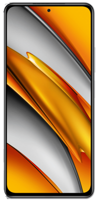
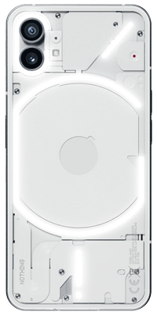
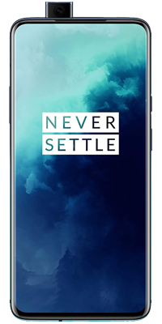

<kbd><b>Connect with us:</b></kbd> 
[</a>](https://t.me/XtendedOfficial "Connect to us on Telegram") [</a>](https://github.com/orgs/Project-Xtended/repositories "Our ROM sources") [</a>](https://twitter.com/projectxtended "Let's talk something")
#

 

 

<b> Official Lenovo Devices</b>

 | Device/Codename           | Lenovo Z6 Pro / Zippo    
 | :---------------          | :------------------------------------------------------------------
 | Current Status            | Active                                                            
 | Maintainer                | [kanstmablason](https://telegram.me/kanstmablason)                     
 | Device Support Group      | [Device Telegram group](https://t.me/LenovoZ6ProChat)                           
 | Download Link             | [Official Download Link for your device](https://downloads.project-xtended.org/?dir=zippo/XT)

 | Device/Codename           | Lenovo Zuk Z2 Plus / z2_plus    
 | :---------------          | :------------------------------------------------------------------
 | Current Status            | Active                                                            
 | Maintainer                | [Pranav Temkar](https://telegram.me/PptOo7)                     
 | Device Support Group      | [Device Telegram group](https://t.me/LenovoZukZ2)                           
 | Download Link             | [Official Download Link for your device](https://downloads.project-xtended.org/?dir=z2_plus/XT)

#
 

 

 

<b> Official Xiaomi/Redmi Devices</b>

 | Device/Codename           | Mi A2 Lite / Daisy   
 | :-------------------------| :----------------------------------------------------------------------
 | Current Status            | Active                                                            
 | Maintainer                | [TogoFire](https://telegram.me/TogoFire)                     
 | Device Support Group      | [Device Telegram group](https://t.me/TogoFireWork)                           
 | Download Link             | [Official Download Link for your device](https://downloads.project-xtended.org/?dir=daisy/XT)

 | Device/Codename           | Mi 9 / Cepheus    
 | :-------------------------| :----------------------------------------------------------------------
 | Current Status            | Active                                                            
 | Maintainer                | [RDS_07](https://telegram.me/RDS_o7)                     
 | Device Support Group      | [Device Telegram group](https://t.me/rds_builds_support)                           
 | Download Link             | [Official Download Link for your device](https://downloads.project-xtended.org/?dir=cepheus/XT)

 | Device/Codename           | Mi 9 SE / Grus   
 | :-------------------------| :----------------------------------------------------------------------
 | Current Status            | Active                                                            
 | Maintainer                | [RDS_07](https://telegram.me/RDS_o7)                     
 | Device Support Group      | [Device Telegram group](https://t.me/Swaggers_builds)                           
 | Download Link             | [Official Download Link for your device](https://downloads.project-xtended.org/?dir=grus/XT)

 | Device/Codename           | Mi 9T Pro / Raphael    
 | :-------------------------| :----------------------------------------------------------------------
 | Current Status            | Active                                                            
 | Maintainer                | [pawelik001](https://telegram.me/pawelik001)                     
 | Device Support Group      | [Device Telegram group](https://t.me/pawelikhideout)                           
 | Download Link             | [Official Download Link for your device](https://downloads.project-xtended.org/?dir=raphael/XT)

 | Device/Codename           | MI 10i/10tLite,RN 9pro5g / Gauguin  
 | :-------------------------| :----------------------------------------------------------------------
 | Current Status            | Xtended-XT-v3.5                                                            
 | Maintainer                | [cursed0007](https://telegram.me/cursed0007)                     
 | Device Support Group      | [Device Telegram group](https://t.me/xtendedgauguin)                           
 | Download Link             | [Official Download Link for your device](https://downloads.project-xtended.org/?dir=gauguin/XT)

 | Device/Codename           | Mi 10 Lite 5G / monet   
 | :-------------------------| :----------------------------------------------------------------------
 | Current Status            | Xtended-XT-v3.5                                                            
 | Maintainer                | [Alec Chan](https://telegram.me/alecchangod)                     
 | Device Support Group      | [Device Telegram group](https://t.me/alec_rom_support)                           
 | Download Link   	     | [Official Download Link for your device](https://downloads.project-xtended.org/?dir=monet/XT)

 | Device/Codename           | POCO F3/MI11X/K40 / Alioth  
 | :-------------------------| :----------------------------------------------------------------------
 | Current Status            |   Xtended-XT-v3.5                                             
 | Maintainer                | [OFFENDER](https://telegram.me/lazyafk)                     
 | Device Support Group      | [Device Telegram group](https://t.me/offendersupport)                           
 | Download Link             | [Official Download Link for your device]( https://downloads.project-xtended.org/?dir=alioth/XT )

 | Device/Codename           | Redmi 9T, POCO M3 / Chime    
 | :-------------------------| :----------------------------------------------------------------------
 | Current Status            | Active                                                            
 | Maintainer                | [pawelik001](https://telegram.me/pawelik001)                     
 | Device Support Group      | [Device Telegram group](https://t.me/pawelikhideout)                           
 | Download Link             | [Official Download Link for your device](https://downloads.project-xtended.org/?dir=rchime/XT)

 | Device/Codename           | Redmi Note 6 Pro / Tulip   
 | :-------------------------| :----------------------------------------------------------------------
 | Current Status            | Active                                                            
 | Maintainer                | [official_mocha](https://t.me/official_mocha)                     
 | Device Support Group      | [Device Telegram group](https://t.me/tulipofficial)                           
 | Download Link             | [Official Download Link for your device](https://downloads.project-xtended.org/?dir=tulip/XT)

 | Device/Codename           | Redmi Note 7/7S / Lavender 
 | :-------------------------| :----------------------------------------------------------------------
 | Current Status            | Xtended-XT-v3.5                                                           
 | Maintainer                | [Apex_Not_Legend](https://telegram.me/Apex_Not_Legend)                     
 | Device Support Group      | [Device Telegram group](https://t.me/noob_gang69)                           
 | Download Link             | [Official Download Link for your device]( https://downloads.project-xtended.org/?dir=lavender/XT )

 | Device/Codename           | Redmi Note 7 Pro / Violet   
 | :-------------------------| :----------------------------------------------------------------------
 | Current Status            | Xtended-XT-v3.5                                                            
 | Maintainer                | [Abhi](https://t.me/abhix202)                     
 | Device Support Group      | [Official Telegram group](https://t.me/XtendedOfficial)                            
 | Download Link             | [Official Download Link for your device](https://downloads.project-xtended.org/?dir=violet/XT)

 | Device/Codename           | Redmi Note 10 Pro / Sweet   
 | :-------------------------| :----------------------------------------------------------------------
 | Current Status            | Active                                                            
 | Maintainer                | [Suresh](https://t.me/Black_Serpent)                     
 | Device Support Group      | [Device Telegram group](https://t.me/blackserpentsupport)                            
 | Download Link             | [Official Download Link for your device](https://downloads.project-xtended.org/?dir=sweet/XT)

 | Device/Codename           | Poco M2 Pro / Miatoll   
 | :-------------------------| :----------------------------------------------------------------------
 | Current Status            | Active                                                            
 | Maintainer                | [Cosmic](https://t.me/cos0i)                     
 | Device Support Group      | [Official Telegram group](https://t.me/XtendedOfficial)                            
 | Download Link             | [Official Download Link for your device](https://downloads.project-xtended.org/?dir=miatoll/XT)

 | Device/Codename           | Redmi Note 8/8T / Ginkgo/Willow 
 | :-------------------------| :----------------------------------------------------------------------
 | Current Status            | Discontinued after XT-v2                                                             
 | Maintainer                | [TheWeaver786](https://t.me/TheWeaver786)                     
 | Device Support Group      | [Device Telegram group](https://t.me/xtended_ginkgo)                           
 | Download Link             | [Official Download Link for your device](https://downloads.project-xtended.org/?dir=ginkgo/XT)

#
 

 

 

<b> Official Nothing Devices</b>

 | Device/Codename           | Phone1 / Spacewar    
 | :-------------------------| :----------------------------------------------------------------------
 | Current Status            | Xtended-XT-v3.5                                                          
 | Maintainer                | [mukesh22584](https://telegram.me/mukesh22584)                     
 | Device Support Group      | [Official Telegram group](https://t.me/XtendedOfficial)                           
 | Download Link             | [Official Download Link for your device](https://downloads.project-xtended.org/?dir=Spacewar/XT)

#
 

 

 

<b> Official OnePlus Devices</b>

 | Device/Codename           | OnePlus 7t / Hotdogb    
 | :-------------------------| :----------------------------------------------------------------------
 | Current Status            | Xtended-XT-v3.5                                                            
 | Maintainer                | [SuperDroidBond](https://telegram.me/SuperDroidBond)                     
 | Device Support Group      | [Official Telegram group](https://t.me/XtendedOfficial)                           
 | Download Link             | [Official Download Link for your device](https://downloads.project-xtended.org/?dir=hotdogb/XT)

 | Device/Codename           | OnePlus 7t Pro / Hotdog    
 | :-------------------------| :----------------------------------------------------------------------
 | Current Status            | Xtended-XT-v3.5                                                            
 | Maintainer                | [mukesh22584](https://telegram.me/mukesh22584)                     
 | Device Support Group      | [Official Telegram group](https://t.me/XtendedOfficial)                           
 | Download Link             | [Official Download Link for your device](https://downloads.project-xtended.org/?dir=hotdog/XT)

 | Device/Codename           | OnePlus 9 / Lemonade    
 | :-------------------------| :----------------------------------------------------------------------
 | Current Status            | Xtended-XT-v3.5                                                            
 | Maintainer                | [mukesh22584](https://telegram.me/mukesh22584)                     
 | Device Support Group      | [Official Telegram group](https://t.me/XtendedOfficial)                           
 | Download Link             | [Official Download Link for your device](https://downloads.project-xtended.org/?dir=lemonade/XT)

 | Device/Codename           | OnePlus 9Pro / Lemonadep    
 | :-------------------------| :----------------------------------------------------------------------
 | Current Status            | Xtended-XT-v3.5                                                            
 | Maintainer                | [mukesh22584](https://telegram.me/mukesh22584)                     
 | Device Support Group      | [Official Telegram group](https://t.me/XtendedOfficial)                           
 | Download Link             | [Official Download Link for your device](https://downloads.project-xtended.org/?dir=lemonadep/XT)

#
 

 

 

<b> Official Realme Devices</b>

 | Device/Codename           | Realme XT / RMX1921    
 | :-------------------------| :----------------------------------------------------------------------
 | Current Status            | Active                                                            
 | Maintainer                | [jigen_was_here](https://telegram.me/kssrao13882)                     
 | Device Support Group      | [Device Telegram group](https://t.me/RealmeXTofficial)                           
 | Download Link             | [Official Download Link for your device](https://downloads.project-xtended.org/?dir=RMX1921/XT)

 | Device/Codename           | Realme 5 Pro / RMX1971    
 | :-------------------------| :----------------------------------------------------------------------
 | Current Status            | Xtended-XT-v3.5                                                            
 | Maintainer                | [Samba Siva Rao K](https://telegram.me/kssrao13882)                     
 | Device Support Group      | [Device Telegram group](https://telegram.me/Xtended_RMX1971)                           
 | Download Link             | [Official Download Link for your device](https://downloads.project-xtended.org/?dir=RMX1971/XT)

 | Device/Codename           | Realme GT Neo 2 / Bitra    
 | :-------------------------| :----------------------------------------------------------------------
 | Current Status            | Xtended-XT-v3.5                                                           
 | Maintainer                | [Andreock](https://t.me/Andreock)                     
 | Device Support Group      | [Device Telegram group](https://t.me/realmegtneo2dragon)                           
 | Download Link             | [Official Download Link for your device](https://downloads.project-xtended.org/?dir=bitra/XT)

#
 
